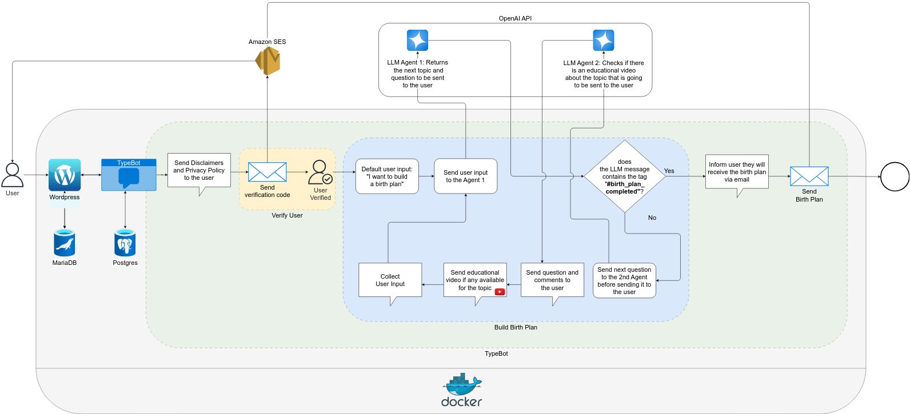

# Doula de Cabeceira - AI-Powered Birth Plan with Social Impact

## 🌱 Overview

**Doula de Cabeceira** is a social impact project designed to empower pregnant individuals to create a **personalized and informed birth plan** through a conversational and educational digital experience. The mission is to **democratize access to information about childbirth**, promoting respectful and conscious choices for all birthing people.

You can give it a try at [douladecabeceira.com.br/plano-de-parto](http://www.douladecabeceira.com.br/plano-de-parto) (currently in Portuguese).

## 🎯 Goal

To enable anyone expecting a baby to easily and safely create a comprehensive birth plan, using natural language processing (NLP), educational content, and email delivery — all wrapped in a friendly, human-centered interface.

---

## 🧠 How It Works (Technical Summary)

The system is built using Docker and integrates multiple components to offer a seamless and informative user experience. Here's how the process flows (as seen in the diagram):

### 1. **Initial Access**
- The user visits a **WordPress** page, which embeds a **TypeBot** conversation interface.
- **MariaDB** and **Postgres** are used to store user data and conversation states.

### 2. **Privacy & User Verification**
- Disclaimers and privacy policy are presented to the user.
- A **verification code is sent via email** using **Amazon SES**.
- Once verified, the birth plan journey begins.

### 3. **Interactive Birth Plan Creation**
- The flow starts with a default input: _"I want to build a birth plan"_.
- **LLM Agent 1** determines the next topic and question to ask the user.
- **LLM Agent 2** checks for **educational videos** relevant to the topic.
- The system then:
  - Sends the question and any available video to the user.
  - Collects the user's answer.
  - Repeats the cycle until the agent includes the tag `#birth_plan_completed`.

### 4. **Sending the Birth Plan**
- Once complete, the user is notified that the birth plan will be emailed.
- The final plan is sent via **Amazon SES**.

---## 📊 Architecture Diagram

---

## 🛠️ Tech Stack

- **WordPress**: Landing page and user interface
- **TypeBot**: Chat-like user interaction
- **OpenAI API**: Two LLM agents (topic flow + video matching)
- **Amazon SES**: Email delivery (verification & plan)
- **Docker**: Container orchestration
- **MariaDB / Postgres**: Data persistence

---

## 💜 Social Impact

This project is committed to:

- **Bridging information gaps** in childbirth education.
- **Promoting autonomy and informed decision-making** for pregnant individuals.
- **Making doula-like guidance available remotely**, anywhere and anytime.
- **Encouraging the creation of birth plans**, as recommended by WHO and Brazil’s public health system (SUS).

---

## 📩 Contact

Want to learn more, collaborate, or support the project?

Website: [www.douladecabeceira.com.br](http://www.douladecabeceira.com.br)  
Instagram: [@douladecabeceira](https://www.instagram.com/douladecabeceira)

---
